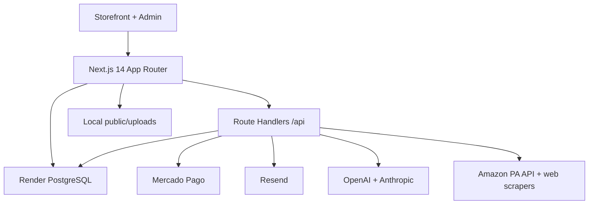
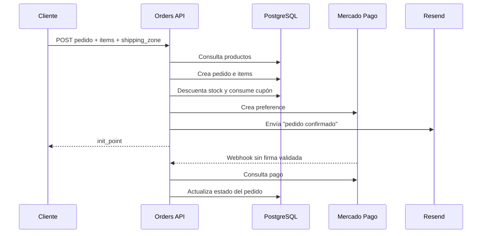
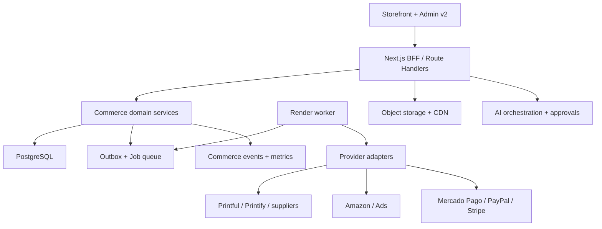

# AI Commerce OS — Repository Audit

**Repositorio:** `gptcatolicos-droid/latiendadecomics`

**Commit auditado:** `a10f7053b1ec654565514fedf23412b06297578f`

**Fecha:** 2026-09-01

**Estado:** Fase 0 terminada; no se modificó código de producto ni infraestructura productiva.

## 1. Resumen ejecutivo

La tienda ya es una aplicación ecommerce funcional y aprovechable. No debe reemplazarse. El núcleo actual —Next.js App Router, PostgreSQL, catálogo, checkout, pedidos, Mercado Pago, importadores, correo y administración básica— permite evolucionar hacia un AI Commerce OS sin reconstruir el storefront ni el checkout desde cero.

Sin embargo, la base transaccional y de seguridad no está lista para colocar encima integraciones masivas o automatizaciones. Antes del rediseño visual y de los nuevos módulos deben resolverse fallas P0 que afectan dinero, inventario, privacidad y control administrativo:

1. El checkout descuenta inventario y consume cupones antes de confirmar el pago; no existe reserva con expiración ni transacción de base de datos.
2. El endpoint público de creación de pedidos acepta cantidades y zona de envío sin un esquema de validación estricto. Cantidades negativas pueden alterar inventario y totales.
3. Pedidos completos, incluida información personal, pueden consultarse sin autenticación mediante `/api/orders/[id]` y la página de confirmación confía en un parámetro de URL para mostrar éxito.
4. El webhook de Mercado Pago no valida la firma. Existe una función de verificación, pero no se utiliza y su algoritmo no corresponde al manifiesto oficial.
5. El login incorpora una contraseña administrativa y un secreto JWT de respaldo conocidos si faltan variables de entorno; no tiene rate limit, bloqueo, MFA ni RBAC.
6. `/api/admin/gallery-covers` permite modificar contenido sin autenticación.
7. `/api/abandoned-cart` permite enviar correos a cualquier destinatario sin rate limit, persistencia, consentimiento o deduplicación.
8. La compilación ignora TypeScript y ESLint; actualmente existen 29 errores de TypeScript, `npm ci` no funciona y la auditoría de dependencias reporta 21 vulnerabilidades (1 crítica y 16 altas).

### Decisión de arquitectura

Se recomienda un **monolito modular** en Next.js + PostgreSQL durante las primeras fases, con límites de dominio claros, adaptadores externos y una outbox/cola respaldada por PostgreSQL. No se justifican microservicios, Redis ni otro framework todavía. Un worker separado en Render puede añadirse cuando comiencen sincronizaciones y webhooks, reutilizando el mismo código y la misma base de datos.

### Orden correcto

`Secure transactional core → Admin foundation → Commerce modules → Integrations → Growth → Intelligence`

El nuevo diseño Apple Music + Shopify debe empezar en el segundo sprint, inmediatamente después de cerrar los P0, mediante feature flag `ENABLE_NEW_ADMIN`.

---

## 2. Alcance y método

Se inspeccionaron los 119 archivos versionados, 15.678 líneas de TypeScript/TSX/CSS, 27 rutas API y 14 pantallas administrativas. También se revisaron configuración, historial, despliegue, dependencias, modelo de datos, autorización, checkout, pagos, inventario, importadores, correo, IA, contenido y storefront.

Validaciones ejecutadas:

| Validación | Resultado |
|---|---|
| `git status` | `main` limpio antes de la auditoría |
| `npm ci` | Falla: `package.json` y `package-lock.json` no están sincronizados (`picomatch`) |
| `tsc --noEmit` | Falla con 29 errores |
| `npm run lint` | No existe configuración; abre un prompt interactivo |
| `npm run build` | Compila JS, omite tipos/lint y falla al recolectar rutas si falta `OPENAI_API_KEY` |
| `npm audit` | 21 vulnerabilidades: 1 crítica, 16 altas, 2 moderadas, 2 bajas |
| Tests automatizados | 0 archivos |
| CI/CD en GitHub | 0 workflows |

La viabilidad de integraciones se contrastó con documentación oficial vigente al 2026-09-01. Las capacidades que requieren aprobación comercial se marcan como condicionales; no se asume que una API pública equivale a acceso aprobado.

---

## 3. Arquitectura actual



### Stack y versiones observadas

| Capa | Tecnología | Versión/estado |
|---|---|---|
| Runtime declarado | Node.js | No fijado en repo; `deploy.sh` instala Node 20 |
| Framework | Next.js App Router | 14.2.5 |
| UI | React / React DOM | 18.3.1 |
| Lenguaje | TypeScript | `^5.5.3`; lock resuelve 5.9.3; `strict: false` |
| Estilos | Tailwind + CSS + inline styles | Tailwind 3.4.x; uso dominante de inline styles |
| Datos | PostgreSQL con `pg` | 8.x, consultas SQL manuales |
| ORM | Ninguno | SQL directo |
| Autenticación | JWT HS256 en cookie | Sesión única de admin, 7 días |
| Pagos | Mercado Pago SDK | 2.x; Checkout Preference |
| Email | Resend | 3.x |
| IA | OpenAI + Anthropic | dos clientes y rutas parcialmente duplicadas |
| Estado frontend | React Context + `localStorage` | carrito local, sin sesión de servidor |
| Archivos | Disco local `public/uploads` | imágenes únicamente; no es durable en Render |
| Despliegue vigente | Render web service + PostgreSQL | `render.yaml` |
| Despliegue legado | Hetzner + PM2 + Nginx | `deploy.sh` y README desactualizados |
| Cache | Ninguna capa explícita | sin Redis ni cache de aplicación |
| Jobs/colas/cron | No existen | tareas síncronas o timers del navegador |
| Observabilidad | `console.log/error` | sin APM, tracking, health de integraciones ni alertas |
| CI/CD | No existe workflow | Render construye directamente |

### Flujo comercial actual



El problema estructural es que inventario, cupón y confirmación por email ocurren **antes** del pago. El flujo debe cambiar a reserva temporal y confirmación server-side.

---

## 4. Mapa funcional actual

| Área | Existe | Estado | Problemas | Oportunidad | Prioridad |
|---|---|---|---|---|---|
| Dashboard | Sí | Regular | Solo ventas/pedidos/productos; moneda rotulada como COP aunque suma USD; no profit/traffic/CVR | Home ejecutivo con métricas confiables e insights | P1 |
| Products | Sí | Regular | CRUD, imágenes, SEO, preventa e importación; formulario largo; sin variantes normalizadas ni costos | Editor modular, product intelligence y bulk AI | P1 |
| Categories | Parcial | Malo | Campo texto en `products`; sin entidad, slug, SEO, jerarquía o reglas | Modelo propio y merchandising | P1 |
| Collections | No | — | Sin colección manual/automática | Reglas y plantillas | P2 |
| Sections | Parcial | Malo | Ajustes visuales y header guardados como settings; no Page → Section → Block | Builder limitado y seguro | P2 |
| Media | Parcial | Malo | `product_images` y upload local; sin librería, uso, metadata, video/audio | Media assets en object storage | P1 |
| Orders | Sí | Malo | Sin transacciones, estados normalizados, reservas, refunds o audit log | Order lifecycle y fulfillment timeline | P0 |
| Customers | Parcial | Malo | Datos embebidos en orders y tabla de leads; sin customer entity | Customer 360 y consentimiento | P2 |
| Inventory | Parcial | Malo | Entero en producto; descuento pre-pago; sin ledger/reserva/warehouse | Ledger, reservas y sync | P0 |
| Payments | Parcial | Malo | Solo Mercado Pago; sin firma, idempotencia, transacciones o refunds | PaymentProvider + Payment Hub | P0/P1 |
| Shipping | Parcial | Malo | Dos tarifas planas; zona confiada al cliente | Reglas server-side y adapter futuro | P0/P2 |
| Analytics | Parcial | Malo | Formulario para GA4 y sumas simples; no event model | Commerce events, funnel y profit | P1 |
| Marketing | Parcial | Malo | Publicación básica en Facebook Graph v19; no Ads | Ad adapters y reporting read-only | P2 |
| Abandoned carts | Parcial | Malo | Timer del navegador y email directo; no se guardan carts | Persistencia, consentimiento, scoring y workflow | P0/P1 |
| Dropshipping | Parcial | Malo | Scraping/importación por URL; no sync, adapter, supplier order o tracking | SupplierAdapter y control center | P1/P2 |
| Marketplaces | Parcial | Malo | Amazon Product Advertising API para afiliados; no Seller Central | MarketplaceAdapter + SP-API | P2 |
| AI | Sí, parcial | Regular | Chat/SEO/descripción; dos proveedores y lógica duplicada; no contexto comercial confiable | Copiloto read-only con provenance y approvals | P1 |
| Automations | No | — | Sin triggers persistentes, cola, retries ni logs | Event/outbox + rules engine | P1/P2 |
| Integrations | No | — | Credenciales dispersas en env; sin estados ni health | Registry + connections + sync runs | P1 |
| Content/blog | Sí, parcial | Regular | Galerías, portadas, personajes, diseño; tablas específicas y DDL en requests | Consolidar CMS sin perder contenido | P2 |

---

## 5. Auditoría de capacidades reutilizables

| Capability | Existing | Reusable | Needs Refactor | New Development |
|---|---:|---:|---:|---:|
| Next.js storefront y routing | Sí | Sí | Menor | No |
| PostgreSQL y pool | Sí | Sí | Sí: repositorios, transacciones, migraciones | No |
| Login admin | Sí | Parcial | Sí: fail-closed, rate limit, RBAC/MFA | Roles y sesiones |
| Product CRUD | Sí | Sí | Sí: validación, servicios, variantes | Inteligencia y módulos |
| Image uploader | Sí | Parcial | Sí: MIME real, object storage | Media Library |
| Video/audio | No | No | — | Sí |
| Rich text editor | No | No | — | Sí, sanitizado |
| Page/section builder | Parcial | Parcial | Sí | Sí |
| Orders | Sí | Parcial | Crítico | Lifecycle/fulfillment |
| Mercado Pago | Sí | Parcial | Crítico | Transaction center/refunds |
| Payment abstraction | No | No | — | Sí |
| Stripe / PayPal | No | No | — | Sí, después de MP |
| Product analytics | No | No | — | Sí |
| Abandoned carts | Parcial | No para backend | Rehacer flujo | Sí |
| Meta | Publicación orgánica | Parcial | Graph version/OAuth | Marketing API |
| Google Ads / TikTok Ads | No | No | — | Sí |
| Amazon | PA API afiliados | Sí para búsqueda afiliada | Separar del marketplace | SP-API + Ads API |
| Supplier import | Sí | Sí | Encapsular, validar y reducir scraping | Adapters/sync |
| Printful / Printify | No | No | — | Sí |
| Email templates | Sí | Sí | Sanitizar contenido y estados | Event-driven delivery |
| Tests/CI | No | No | — | Sí |

---

## 6. Hallazgos críticos

### P0 — dinero, privacidad, seguridad e integridad

| ID | Hallazgo y evidencia | Impacto | Remediación |
|---|---|---|---|
| P0-01 | `POST /api/orders` crea orden, items, descuenta stock y aumenta uso de cupón antes del pago (`src/app/api/orders/route.ts:40-141`) | Agotamiento de inventario, cupones consumidos y pedidos falsos | Transacción DB + `inventory_reservations`; confirmar descuento/uso en webhook verificado; liberar al expirar |
| P0-02 | No hay schema de entrada; se confían `quantity`, `shipping_zone`, customer y address | Cantidad negativa puede aumentar stock; zona barata puede forzarse; DoS por lotes grandes | Zod en frontera, límites, enteros positivos, zona derivada del país server-side |
| P0-03 | Orden y stock se escriben con múltiples queries sin `BEGIN/COMMIT/ROLLBACK` | Estados parciales y overselling bajo concurrencia | Servicio transaccional, `SELECT ... FOR UPDATE` o update atómico, constraints |
| P0-04 | `GET /api/orders/[id]` no requiere admin y devuelve PII; confirmación consulta DB directamente (`src/app/api/orders/[id]/route.ts:7-11`) | Exposición de email, teléfono, dirección, items y tracking | Token público aleatorio de vista, respuesta DTO mínima; admin separado y autenticado |
| P0-05 | Página de confirmación interpreta `?status=success` como éxito sin verificar pago | Mensaje falso de pedido confirmado | Renderizar exclusivamente estado persistido verificado server-side |
| P0-06 | Webhook no comprueba `x-signature`; `verifyWebhookSignature()` no se usa y usa `Date.now()`/request ID en lugar de `data.id` y `ts` recibidos | Webhooks no autenticados, replays, inconsistencias | Verificación HMAC oficial, comparación constant-time, event log único e idempotencia |
| P0-07 | Fallback JWT y contraseña admin conocidos (`src/lib/auth.ts:6-8`, `src/app/api/auth/route.ts:6-7`) | Toma del admin si el entorno está incompleto | Fallar al arrancar sin secretos; eliminar bootstrap inseguro; rotación inmediata si se usó |
| P0-08 | Login sin rate limiting, lockout, MFA o registro de intentos | Credential stuffing y fuerza bruta | Rate limit por IP/cuenta, backoff, MFA para owner, audit log |
| P0-09 | `PATCH/POST /api/admin/gallery-covers` no tienen auth | Modificación pública del contenido | `requirePermission('content:write')` en todas las mutaciones |
| P0-10 | `/api/abandoned-cart` envía email arbitrario, acepta HTML interpolado y no limita frecuencia | Spam, costo de Resend, daño de dominio y HTML injection en correo | Persistir cart/consent; signed action, rate limit, sanitize/escape, dedupe y unsubscribe |
| P0-11 | `GET /api/settings` devuelve todos los settings sin auth | Riesgo de filtrar futuras credenciales/configuración privada | Allowlist pública; endpoint admin autenticado; secretos fuera de `settings` |
| P0-12 | Next 14.2.5 y lock actual presentan vulnerabilidades; `npm audit` marca Next como crítico | Riesgos conocidos en framework/dependencias | Patch controlado primero a 14.2.35, lock reproducible, luego plan de major separado |

> La documentación oficial de Mercado Pago requiere construir el manifiesto con `data.id`, `x-request-id` y el `ts` extraído de `x-signature`, y responder 401 si no coincide. Referencia: https://www.mercadopago.com.co/developers/en/docs/checkout-api-orders/optional-notifications

### P1 — base funcional necesaria

| ID | Hallazgo | Acción |
|---|---|---|
| P1-01 | No hay migraciones; `ensureInit()` ejecuta DDL en runtime y rutas CRUD hacen `ALTER TABLE` | Introducir migraciones versionadas, tabla `schema_migrations`, rollback y prohibir DDL en requests |
| P1-02 | `ensureInit()` marca `initialized=true` antes de completar; errores se registran y continúan | Inicialización fail-fast y health check de DB |
| P1-03 | No se separan `order_status`, `payment_status` y `fulfillment_status` | Estados y timelines independientes |
| P1-04 | No existe ledger ni reservas de inventario | `inventory_levels`, `inventory_movements`, `inventory_reservations` |
| P1-05 | No hay entidad de pago/transacción/webhook | `payments`, `payment_transactions`, `webhook_events`, idempotency keys |
| P1-06 | Categoría es texto y las variantes no están modeladas | Entidades aditivas con migración compatible |
| P1-07 | Uploads en disco efímero de Render | Object storage/CDN, URLs firmadas para write, validación MIME real |
| P1-08 | Analytics no instrumenta ecommerce | Taxonomía de eventos server/client y métricas definidas |
| P1-09 | IA pública y scrapers carecen de cuotas globales | Rate limit, presupuesto, caching y observabilidad |
| P1-10 | La ruta de importación admite dominio genérico si la URL contiene `/products/` | Allowlist/SSRF guard, DNS/IP validation y timeouts |
| P1-11 | `npm ci` falla; no hay `.gitignore`, ESLint, tests o workflows | Build reproducible y quality gates |
| P1-12 | Build requiere secrets al importar módulos y oculta errores de tipos/lint | Inicialización perezosa de SDK; quitar ignores después de corregir baseline |
| P1-13 | Email confirma antes de pago y el asunto dice “confirmado” | Separar “pedido recibido” de “pago aprobado” |
| P1-14 | Número anual `COUNT(*) + 1` tiene carrera | Secuencia DB o identificador monotónico único |

### P2 — UX, productividad y crecimiento

- Convertir el admin de estilos inline por pantalla a design tokens y componentes compartidos.
- Sidebar jerarquizado; command palette; responsive admin; loading/error/empty states consistentes.
- Editor de producto modular con variantes, costos, media, SEO, channels y analytics.
- Media Library, categories, collections y sections.
- Customers, abandoned cart center, integrations center y automation rules.
- Adapters read-only para Ads y Amazon antes de habilitar mutaciones.
- Reemplazar loops de cientos de requests desde el navegador por bulk jobs server-side.

### P3 — inteligencia avanzada

- AI Product Score, merchandising predictivo, profit attribution y forecasts.
- Multistore real, routing avanzado de pagos y almacenes múltiples solo cuando haya un caso comercial confirmado.
- Redis/streaming warehouse únicamente cuando volumen y latencia lo justifiquen.

---

## 7. Qué conservar, mejorar y reconstruir

### Conservar

- Next.js App Router y la estructura `src/app`.
- PostgreSQL y consultas parametrizadas actuales como punto de partida.
- URLs públicas, SEO, sitemap, catálogo, productos y páginas de contenido.
- Checkout visual y Mercado Pago como primera pasarela, corrigiendo el lifecycle.
- CRUD de productos, pedidos, cupones, importación y galerías.
- Resend y plantillas transaccionales, disparadas por eventos correctos.
- Amazon Product Advertising API como capacidad afiliada independiente.
- Lógica de catálogo de comics, personajes, preventas y reglas de proveedores que sea verificable.

### Mejorar

- Encapsular SQL en repositorios y servicios de dominio.
- Mover autorización al servidor y añadir permisos.
- Convertir settings visuales a contratos tipados y allowlists.
- Unificar clientes OpenAI/Anthropic bajo un `AIProvider` y una capa de herramientas autorizadas.
- Convertir imports y bulk updates en jobs idempotentes.
- Centralizar design tokens y componentes UI.
- Asegurar uploads, HTML generado, embeds y URLs externas.

### Reconstruir de forma compatible

- Lifecycle de pedido/pago/inventario.
- Webhooks y su auditoría.
- Abandoned carts.
- Migraciones y CI.
- Media storage.
- Analytics event model.

No se recomienda reconstruir todo el storefront ni sustituir Next.js/PostgreSQL.

---

## 8. Arquitectura objetivo



### Módulos del monolito

```text
src/
  modules/
    auth/
    catalog/
    content/
    media/
    orders/
    inventory/
    payments/
    customers/
    carts/
    suppliers/
    marketplaces/
    marketing/
    analytics/
    automations/
    integrations/
    ai/
  infrastructure/
    db/
    jobs/
    observability/
    storage/
  app/
    admin/
    api/
```

No es obligatorio mover todos los archivos en un único refactor. Los nuevos módulos pueden convivir con `src/lib` y absorber lógica gradualmente.

### Contratos principales

```ts
interface PaymentProvider {
  createCheckout(input: CreateCheckoutInput): Promise<CheckoutResult>;
  getPayment(externalId: string): Promise<NormalizedPayment>;
  refund(input: RefundInput): Promise<RefundResult>;
  verifyWebhook(request: WebhookRequest): Promise<VerifiedEvent>;
  handleWebhook(event: VerifiedEvent): Promise<void>;
}

interface SupplierAdapter {
  getProducts(cursor?: string): Promise<Page<SupplierProduct>>;
  getInventory(skus: string[]): Promise<InventorySnapshot[]>;
  getPrices(skus: string[]): Promise<PriceSnapshot[]>;
  createOrder(order: SupplierOrderInput): Promise<SupplierOrderResult>;
  getOrderStatus(externalId: string): Promise<SupplierOrderStatus>;
  cancelOrder(externalId: string): Promise<void>;
}

interface MarketplaceAdapter {
  listListings(cursor?: string): Promise<Page<MarketplaceListing>>;
  syncListing(input: ListingInput): Promise<SyncResult>;
  getOrders(cursor?: string): Promise<Page<MarketplaceOrder>>;
  getInventory(skus: string[]): Promise<InventorySnapshot[]>;
}
```

### Cola y consistencia

Fase inicial:

- `outbox_events` y `jobs` en PostgreSQL.
- Worker separado con `FOR UPDATE SKIP LOCKED`.
- Idempotency key única por provider/event/action.
- Backoff exponencial, máximo de intentos, dead-letter status y replay manual.
- Una transacción escribe el cambio de negocio y el evento outbox.

Redis se evalúa después de medir throughput; no es requisito de Foundation.

---

## 9. Modelo de datos

### Tablas actuales

`products`, `product_images`, `orders`, `order_items`, `coupons`, `exchange_rates`, `admin_users`, `settings`, `customer_leads`, `cb_galleries`, `cb_covers`, `characters`.

### Cambios aditivos propuestos

| Dominio | Tablas | Estrategia de compatibilidad |
|---|---|---|
| Identity | `roles`, `permissions`, `admin_user_roles`, `admin_sessions`, `login_attempts` | Mantener `admin_users`; migrar password hash sin reset obligatorio |
| Catalog | `product_variants`, `product_prices`, `product_costs`, `categories`, `product_categories`, `collections`, `collection_products` | Mantener columnas actuales; dual-read detrás de flag |
| Content | `pages`, `sections`, `section_blocks`, `navigation_items` | Settings existentes siguen funcionando hasta migración |
| Media | `media_assets`, `media_usages` | Backfill de `product_images`; conservar URLs |
| Customers | `customers`, `customer_addresses`, `customer_consents` | Backfill incremental desde orders; no fusionar solo por nombre |
| Carts | `carts`, `cart_items`, `cart_events`, `recovery_attempts` | Importar cart al servidor al identificar email/session |
| Orders | añadir `public_token`, `payment_status`, `fulfillment_status`, `currency`; `order_status_events` | No cambiar URLs admin; ocultar PII en endpoint público |
| Inventory | `inventory_locations`, `inventory_levels`, `inventory_movements`, `inventory_reservations` | `products.stock` se mantiene como proyección durante transición |
| Payments | `payment_connections`, `payments`, `payment_transactions`, `refunds`, `payment_webhook_events` | Backfill de `orders.payment_id` |
| Suppliers | `suppliers`, `supplier_connections`, `supplier_products`, `supplier_variants`, `supplier_orders` | `products.supplier*` sigue siendo fallback |
| Marketplaces | `marketplace_connections`, `marketplace_listings`, `marketplace_orders` | Amazon PA API queda fuera de este modelo |
| Marketing | `ad_connections`, `ad_accounts`, `campaign_snapshots` | Comenzar read-only |
| Integrations | `integration_connections`, `sync_runs`, `integration_errors` | Secrets cifrados o secret manager; nunca texto plano en UI |
| Analytics | `commerce_events`, agregados diarios | Particionar solo cuando el volumen lo justifique |
| Automations | `automation_rules`, `automation_runs`, `automation_actions` | Acciones sensibles requieren approval |
| Platform | `audit_logs`, `outbox_events`, `jobs`, `feature_flags`, `schema_migrations` | Base transversal |

### Constraints mínimas

- `quantity > 0`, importes no negativos y currency ISO.
- Unique idempotency keys para payment/provider webhook.
- Unique order number generado por secuencia.
- Estado normalizado con transición validada; conservar `provider_status` original.
- Reservas con `expires_at`, índice por status/expiration y liberación idempotente.
- Foreign keys reales para order items/product cuando sea compatible; snapshot de título/precio se conserva.

### Dinero

A largo plazo, almacenar montos en unidad menor entera + currency. Para no romper producción, no se eliminan las columnas DECIMAL actuales: se añaden campos normalizados, se hace backfill, dual-write, verificación y solo después se cambia lectura.

---

## 10. Estrategia de integraciones

### POD y dropshipping

| Plataforma | Acceso/API verificado | Auth | Products | Orders | Inventory/Tracking | Webhooks | Clasificación | Recomendación |
|---|---|---|---:|---:|---:|---:|---|---|
| Printful | API oficial v1; v2 beta | Private token / OAuth según app | Sí | Sí | Sí | Sí; v2 añade firma | Native integration | Primera POD, detrás de flag |
| Printify | REST oficial | PAT para una cuenta; OAuth 2.0 para plataforma | Sí | Sí | Sí | Sí | Native integration | Primera POD junto a Printful |
| CJdropshipping | Portal oficial con auth, product, storage, shopping, logistics, dispute, shop y sandbox | Access token | Sí | Sí | Sí | Sí | Native integration | Spike después de POD |
| DSers | Programa de Channel/Supplier Apps con aprobación | Partner app | Sí | Sí | Condicional al programa | Condicional | Partner integration | Preferible a scraping directo de AliExpress |
| AliExpress | No se aprobó acceso directo durante esta auditoría | Partner/Open Platform | Condicional | Condicional | Condicional | Condicional | Partner/limited | No construir scraping; usar DSers hasta aprobar API y políticas |
| AutoDS | API disponible por solicitud, aprobación y activation fee; docs después de aprobación | Credenciales privadas/flujo aprobado | Sí | Sí | Sí | Por confirmar en docs privadas | Partner integration | Viable comercialmente; spike contractual |
| Zendrop | Integraciones directas limitadas; “Direct API Access” se solicita; MCP oficial disponible | Partner/MCP | Condicional | Condicional | Condicional | Condicional | Limited/partner | No prometer integración nativa sin aprobación |
| Syncee | Datafeed CSV/XML/XLS/JSON; API/SOAP mediante contacto | Feed/partner | Sí | Limitado | Sí por feed | No público verificado | Limited integration | Import/sync de catálogo primero |
| Wholesale2B | Plan API oficial de pago | API credentials | Sí | Sí | Sí | Tracking webhooks | Native paid integration | Candidato fuerte para catálogo masivo |
| BigBuy | REST docs oficiales | Token/OAuth según programa | Sí | Sí | Sí | Verificar por endpoint | Native candidate | Relevante para Europa, no Phase 1 |
| Gelato | API comercial oficial; acceso debe confirmarse en cuenta | API key | Sí | Sí | Tracking | Verificar | Native candidate | Alternativa POD posterior |
| Gooten | VIM/API comercial; acceso contractual | API key/recipe | Sí | Sí | Tracking | Verificar | Partner/native candidate | Posterior |
| Spocket | No se verificó API pública general | Partner | No verificado | No verificado | No verificado | No verificado | Not recommended initially | Contacto comercial antes de desarrollo |
| Modalyst | No se verificó API pública standalone; foco en ecosistemas existentes | Partner | No verificado | No verificado | No verificado | No verificado | Not recommended initially | No priorizar |

Fuentes primarias:

- Printful: https://developers.printful.com/docs/ y https://developers.printful.com/docs/v2-beta/
- Printify: https://developers.printify.com/
- CJdropshipping: https://developers.cjdropshipping.com/en/api/start/
- DSers: https://www.dsers.com/developers/api-overview/
- AutoDS: https://help.autods.com/en/articles/12699964-autods-api-feature-automate-product-imports-orders-and-sourcing
- Zendrop: https://support.zendrop.com/en/articles/12582165-requesting-new-store-integrations-on-zendrop
- Syncee: https://help.syncee.com/en/articles/4215534-how-to-list-your-products-from-a-datafeed-file-as-a-supplier
- Wholesale2B: https://www.wholesale2b.com/dropship-api-plan.html
- BigBuy: https://api.bigbuy.eu/rest/doc

### Marketplaces

| Plataforma | Estado actual | Objetivo | Prerrequisitos | Fase |
|---|---|---|---|---|
| Amazon Product Advertising | Implementado para afiliados/búsqueda | Mantener separado | Credenciales PA API | Keep |
| Amazon Seller Central | No existe | Listings, inventory, orders, pricing, returns | App SP-API, OAuth/LWA, roles, RDT para PII, políticas | Phase 5 |
| Amazon Ads | No existe | Campaigns/reporting inicialmente read-only | Aprobación Amazon Ads API y tres credenciales | Phase 5 |

SP-API y Amazon Ads son programas separados. No se deben reutilizar las credenciales del Product Advertising API. Fuentes: https://developer-docs.amazon.com/sp-api/docs/welcome y https://advertising.amazon.com/API/docs/en-us/guides/onboarding/apply-for-access

### Marketing

| Canal | Viabilidad | Primera capacidad | Riesgo de acceso |
|---|---|---|---|
| Meta Ads | Alta con Marketing API y OAuth/app review | Accounts, campaigns e insights read-only | App review, permisos y versión de Graph |
| Google Ads | Alta con Google Ads API | Reporting GAQL read-only | Developer token + OAuth + customer/manager access |
| TikTok Ads | Alta pero condicionada | Reporting read-only | TikTok for Business app review; no confundir con Developers API |

El código actual solo publica orgánicamente en Facebook y fija Graph `v19.0`; debe tratarse como integración independiente y revalidar versión antes de reutilizar. Google confirma que su Ads API soporta account management, reporting, ads según inventario y bidding: https://developers.google.com/google-ads/api/docs/get-started/introduction. TikTok Marketing API requiere el portal Business API y aprobación: https://business-api.tiktok.com/portal/docs/marketing-api/v1.3

### Pagos

| Gateway | Mercado | API/Webhooks/Refund | Prioridad | Condición |
|---|---|---|---|---|
| Mercado Pago | LATAM/Colombia | Sí / Sí / Sí | P0 reparar, P1 Hub | Mantener checkout actual y corregir lifecycle |
| PayPal | Internacional | Orders/Captures / Sí / Sí | Alta | Cuenta Business; OAuth 2.0 |
| Wompi | Colombia | Sí / Sí / verificar modalidad de refund | Alta | Validar contrato y métodos requeridos |
| Stripe | Internacional | PaymentIntents / Sí / Sí | Media-alta | Confirmar disponibilidad de cuenta para la entidad/país |
| PayU / ePayco / Bold | Colombia/LATAM | Evaluación comercial | Media | Demanda, fees y soporte |
| Adyen / dLocal | Enterprise/regional | Sí | Baja inicialmente | Volumen y contrato |
| Square / Authorize.net | Principalmente US | Sí | Baja | Mercado objetivo |
| Klarna / Afterpay | BNPL por país | Sí | Baja | Elegibilidad/contrato |
| Apple Pay / Google Pay | Wallet, no provider único | Vía gateway compatible | Después | Dominio verificado y gateway |
| Shop Pay | Ecosistema Shopify | No asumir portabilidad | No priorizar | Restricciones de plataforma |

Referencias: Stripe Payment Intents y webhooks en https://docs.stripe.com/payments/payment-intents y https://docs.stripe.com/webhooks; PayPal REST/OAuth en https://developer.paypal.com/api/rest/; Mercado Pago webhooks en https://www.mercadopago.com.co/developers/en/docs/your-integrations/notifications/webhooks

---

## 11. Arquitectura de IA

### Estado actual

- OpenAI y Anthropic se instancian en varios módulos.
- Hay chat público, búsqueda, generación SEO/descripción y experiencias ComicsIA/Jarvis.
- No existe un contexto de negocio autorizado, catálogo de herramientas, trazabilidad de fuentes o approval workflow.
- Costos, rate limits, timeouts y errores no están centralizados.

### Diseño objetivo

1. `AIProvider`: abstracción de modelo, costos, timeout, retries y structured output.
2. `CommerceToolRegistry`: herramientas read-only con permisos y DTOs, no SQL libre generado por IA.
3. `AIContext`: entidad/página actual + rango temporal + store scope + permiso del usuario.
4. `AIInsight`: hecho, cálculo, estimación, fuente, rango y `generated_at`.
5. `AIProposal`: acción sugerida con preview/diff, riesgo y aprobación.
6. `AIExecution`: acción aprobada, idempotency key, actor y audit log.

Primera versión: solo lectura para ventas, inventario, productos, pedidos y carritos. Precios, ads, refunds, cancelaciones e inventario nunca se ejecutan sin aprobación explícita.

---

## 12. Seguridad

### Plan inmediato

- Rotar JWT/admin si alguna vez se desplegó sin variables obligatorias.
- Eliminar todos los defaults de secretos y fallar al boot.
- Proteger mutaciones admin con permisos server-side.
- Rate limits para auth, AI, chat, import, recovery y webhooks.
- Zod en todas las fronteras; límites de arrays, strings, body y paginación.
- Corregir payment lifecycle, firma, idempotencia y replay protection.
- Cerrar exposición pública de PII y aplicar minimización de DTOs.
- CSP, HSTS, Permissions-Policy y headers desde Next/Render; no depender del script Hetzner.
- Validación real de MIME, decodificación segura de imagen y almacenamiento externo.
- Escape/sanitización para emails, rich text y embeds; allowlist de YouTube/Vimeo/Spotify/SoundCloud.
- SSRF guard para importadores: protocolos HTTPS, host allowlist, resolución DNS y bloqueo de IPs privadas/metadata.
- Auditoría inmutable para login, payments, refunds, stock, settings, integrations y AI actions.

### RBAC inicial

| Rol | Alcance |
|---|---|
| OWNER | Todo, conexiones, pagos, roles y acciones sensibles |
| ADMIN | Operación general, sin gestión de owner/secrets |
| OPERATIONS | Orders, inventory, suppliers, fulfillment |
| MARKETING | Content, campaigns y analytics; sin payments/refunds |
| SUPPORT | Customers/orders read; acciones limitadas |
| ANALYST | Solo lectura de analytics |

### Secrets

En Phase 1, mantener secrets en variables de entorno de Render. Cuando se necesiten conexiones por usuario/cuenta, guardar tokens cifrados server-side con una KEK externa y nunca devolverlos al frontend. La UI solo expone estado, cuenta, scopes, expiración y reconnect.

---

## 13. Observabilidad y confiabilidad

- `/api/health/live` sin dependencias y `/api/health/ready` con DB y migración.
- Error tracking con release/commit SHA y redacción de PII.
- `integration_connections`: status, last_success, last_error, token_expiry.
- `sync_runs`: cursor, processed, succeeded, failed, started/finished.
- `webhook_events`: provider ID, signature status, payload hash, attempts, result.
- Métricas de checkout, payment approval, webhook lag, reservation expiry y oversell.
- Alertas humanas: “Mercado Pago necesita reconectarse”, “12 jobs fallaron”, “stock discrepante”.

---

## 14. Event tracking y KPIs

### Eventos canónicos iniciales

`product_viewed`, `product_added_to_cart`, `cart_identified`, `checkout_started`, `order_created`, `payment_started`, `payment_succeeded`, `payment_failed`, `inventory_reserved`, `inventory_released`, `purchase_completed`, `cart_abandoned`, `recovery_sent`, `recovery_converted`, `product_imported`, `supplier_sync_completed`.

Cada evento incluye `event_id`, `occurred_at`, `session_id`, `customer_id?`, `product_id?`, `cart_id?`, `order_id?`, `channel`, `source`, `campaign`, `currency`, `value`, `schema_version` y consentimiento aplicable.

### Definiciones mínimas

- Gross sales: suma antes de descuentos/refunds, solo pagos aprobados.
- Net sales: gross sales − discounts − refunds.
- AOV: net sales / orders pagadas.
- Conversion: purchases / sessions; siempre declarar rango y fuente de sessions.
- Cart abandonment: identified carts sin purchase dentro de ventana configurada / identified carts elegibles.
- Contribution profit estimado: net sales − product cost − shipping − payment/marketplace fees − ads − returns.

No mostrar profit cuando falten costos; mostrar “estimado” y cobertura de datos.

---

## 15. Design system y admin

### Navegación propuesta

```text
Home
Commerce
  Orders
  Products
  Inventory
  Customers
Content
  Categories
  Collections
  Pages & Sections
  Media
Channels
  Dropshipping
  Marketplaces
Growth
  Marketing
  Abandoned carts
  Analytics
Operations
  Automations
  Integrations
Settings
```

Command palette `Cmd/Ctrl + K` para navegación, búsqueda y comandos. Commerce AI permanece global pero contextual.

### Tokens

- Tipografía: sistema Apple/SF fallback; evitar cargar fuentes por cada módulo.
- Superficie: blanco cálido/gris muy claro; sidebar oscuro; acento rojo de marca usado con moderación.
- Radius: 10/14/20; sombras suaves; tablas con densidad adaptable.
- Componentes compartidos: `PageHeader`, `MetricCard`, `InsightCard`, `DataTable`, `StatusBadge`, `EmptyState`, `IntegrationCard`, `Drawer`, `ConfirmDialog`, `Skeleton`.
- Accesibilidad: WCAG AA, focus visible, navegación teclado, labels y reduced motion.

El storefront conserva su identidad. El nuevo design system del admin no debe alterar páginas públicas hasta una fase específica.

---

## 16. Roadmap

| Fase | Entregable | Complejidad | Dependencia |
|---|---|---|---|
| Sprint 1 — Transaction & Security Foundation | P0, migraciones, CI, tests, webhook, reservas, PII | Alta | Ninguna |
| Phase 1 — Admin Foundation | Design system, nav, dashboard, command palette, AI read-only, product shell, media storage | Alta | Sprint 1 |
| Phase 2 — Commerce | Categories, collections, sections, variants, Media Library, Payments Hub/transactions | Alta | Phase 1 |
| Phase 3 — Dropshipping | SupplierAdapter, Printful, Printify, import queue, pricing, inventory sync, order routing | Muy alta | Phase 2 + cuentas |
| Phase 4 — Growth | Commerce events, abandoned carts, Meta/Google/TikTok read-only, attribution | Muy alta | Event model + approvals |
| Phase 5 — Marketplaces | Amazon SP-API, listings, inventory, orders, Ads | Muy alta | Amazon approvals |
| Phase 6 — Intelligence | Product score, merchandising, predictive insights, AI actions/automations | Muy alta | Datos confiables |

No es responsable estimar fechas totales sin confirmar equipo, alcance de la primera versión y accesos externos. La complejidad de integraciones depende de aprobación de cada proveedor, no solo de código.

---

## 17. Primer sprint de desarrollo

### Objetivo

Cerrar riesgos P0 sin cambiar la experiencia pública salvo mensajes de estado más correctos.

### Entregables

1. **Build reproducible**
   - `.gitignore`, Node version, lock sincronizado, ESLint no interactivo.
   - CI: install, typecheck, lint, tests y build con clients lazy/mock.
   - Patch seguro de Next 14 dentro de la misma major; no upgrade indiscriminado.
2. **Security baseline**
   - Secrets fail-closed, auth rate limiting, sesiones auditables.
   - Auth en todas las mutaciones admin y allowlist pública de settings.
   - Zod y límites para orders/auth/uploads/AI/recovery.
3. **Order transaction**
   - Migraciones versionadas.
   - Validación server-side de items, shipping y coupons.
   - Transacción atómica y número de pedido sin carrera.
4. **Inventory reservation**
   - Reservar al iniciar pago; confirmar al aprobar; liberar por rechazo/expiración.
   - No enviar confirmación de pago antes del webhook.
5. **Mercado Pago hardening**
   - Firma oficial, idempotency, event log, amount/currency/order verification.
   - Separar estados de order/payment.
6. **Privacy**
   - Endpoint público de order con token y DTO mínimo.
   - Confirmación basada en estado DB verificado.
7. **Abandoned cart containment**
   - Deshabilitar envío arbitrario o introducir persistencia, consent, rate limit y dedupe mínimos.
8. **Tests críticos**
   - Cantidad negativa/cero, stock concurrente, zone tampering, coupon limits.
   - Webhook inválido/repetido/válido.
   - Acceso sin auth a pedidos/admin/settings.

### Criterios de aceptación

- Un checkout no pagado nunca reduce stock disponible de forma permanente.
- Dos compradores no pueden vender más unidades que el stock real.
- Cantidades no enteras, negativas, cero o excesivas son rechazadas.
- Shipping se calcula en servidor desde la dirección normalizada.
- Un webhook inválido devuelve 401 y no cambia la orden.
- Repetir el mismo webhook no repite stock, email ni estado.
- Ningún endpoint público expone PII de pedido.
- No existen credenciales administrativas de respaldo.
- `npm ci`, typecheck, lint, tests y build pasan en CI.

### Fuera del sprint

Rediseño total, Printful/Printify, Amazon, Ads, Stripe/PayPal y AI actions. Se diseñan, pero se implementan después de asegurar el core.

---

## 18. Estrategia de migración, rollback y feature flags

### Reglas

1. Migraciones solo aditivas al principio.
2. Backfill en jobs pequeños, reanudables e idempotentes.
3. Dual-write y comparación antes de cambiar lecturas.
4. Rollback de aplicación compatible con schema nuevo.
5. No eliminar columnas/tablas durante las primeras fases.

### Flags

`ENABLE_SECURE_ORDER_FLOW`, `ENABLE_NEW_ADMIN`, `ENABLE_MEDIA_LIBRARY`, `ENABLE_PAYMENT_HUB`, `ENABLE_PRINTFUL`, `ENABLE_PRINTIFY`, `ENABLE_AMAZON`, `ENABLE_ADS_READ`, `ENABLE_AI_ASSISTANT`, `ENABLE_AI_ACTIONS`.

Los flags se evalúan server-side para seguridad. No protegen secrets ni reemplazan autorización.

---

## 19. QA

### Pirámide inicial

- Unit: pricing, money, coupons, status transitions, signatures, scoring.
- Integration con PostgreSQL real: migrations, order transaction, reservation, webhook idempotency.
- Contract: fixtures de proveedores y normalización de adapters.
- E2E: browse → cart → checkout → provider sandbox → confirmation; admin login/product/order/refund.
- Security: authz matrix, SSRF, upload polyglots, XSS/embed, rate limit, replay.
- Performance: catálogo paginado, bulk jobs, N+1 y webhook bursts.

Las integraciones externas se prueban con sandbox y recorded fixtures; nunca con scraping live dentro del test suite.

---

## 20. Archivos y carpetas impactados por las primeras fases

### Sprint 1

```text
package.json
package-lock.json
next.config.js
tsconfig.json
.gitignore
.env.example
.github/workflows/ci.yml
src/lib/auth.ts
src/lib/db.ts
src/lib/mercadopago.ts
src/lib/email.ts
src/app/api/auth/route.ts
src/app/api/orders/route.ts
src/app/api/orders/[id]/route.ts
src/app/api/payments/webhook/route.ts
src/app/api/settings/route.ts
src/app/api/abandoned-cart/route.ts
src/app/api/admin/gallery-covers/route.ts
src/app/confirmacion/[orderId]/page.tsx
src/modules/orders/**
src/modules/inventory/**
src/modules/payments/**
src/infrastructure/db/**
src/infrastructure/rate-limit/**
migrations/**
tests/**
```

### Admin Foundation

```text
src/app/admin/**
src/components/admin/**
src/styles/admin-tokens.css
src/modules/analytics/**
src/modules/ai/**
src/modules/media/**
```

### Integraciones

```text
src/modules/integrations/**
src/modules/suppliers/**
src/modules/marketplaces/**
src/modules/marketing/**
src/workers/**
```

---

## 21. Riesgos y decisiones pendientes

| Riesgo/decisión | Por qué importa | Recomendación |
|---|---|---|
| Single-store vs multi-store | Afecta todas las claves y permisos | Mantener single-store; preparar límites de dominio, no multitenancy prematura |
| País/entidad de cobro | Define Stripe/Wompi/PayPal y monedas | Confirmar entidad y cuentas antes de Payments Phase |
| Cuentas de proveedores | Sin aprobación no hay OAuth/sandbox | Solicitar Printful/Printify primero |
| Amazon seller account/region | Define marketplaces, roles y RDT | Spike solo al confirmar Seller Central |
| Object storage | Render disk local no es Media Library | Elegir S3-compatible/Cloudinary según costo y video |
| Consentimiento marketing | Necesario para recovery y ads audiences | Definir política y base legal antes de automatizar |
| Fuente de costos | Sin costo no hay profit real | Añadir costo por variante/proveedor y cobertura |
| Propiedad de clientes | Orders actuales no son customer profiles | Deduplicación conservadora y consent-aware |

---

## 22. Conclusión

La Tienda de Comics puede convertirse en el AI Commerce OS descrito sin desechar la inversión actual. El repositorio tiene un núcleo comercial útil y un admin ya encaminado visualmente, pero la prioridad técnica no es añadir tarjetas ni integraciones todavía: es asegurar el momento en que una intención de compra se convierte en dinero, inventario, email y pedido.

Con el Sprint 1 completado, el rediseño del admin puede avanzar en paralelo con Products/Media y la arquitectura de IA read-only. Printful y Printify son las primeras integraciones externas recomendadas; Amazon y Ads deben esperar sus aprobaciones y un event model confiable. Esta secuencia reduce el riesgo de pérdida de dinero, evita un mega-refactor y cumple el principio rector:

**REUSE → IMPROVE → EXTEND → REPLACE ONLY IF NECESSARY.**
